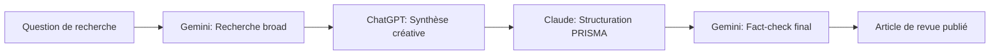
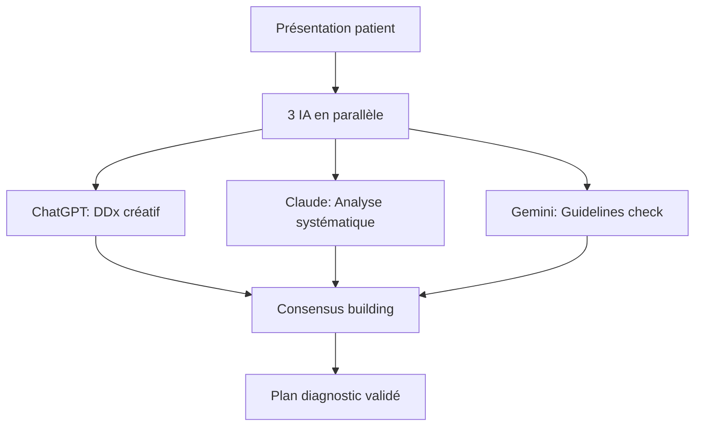

# 🎓 Cours Complet IA Médicale v3.0
## Approche Multi-IA : ChatGPT, Claude & Gemini

## 📚 Table des Matières

1. [Introduction à l'IA Médicale Multi-Outils](#introduction)
2. [Comparaison des 3 IA Leaders](#comparaison)
3. [Prompts Fondamentaux](#prompts)
4. [Workflows Optimisés](#workflows)
5. [Détection des Hallucinations](#hallucinations)
6. [ROI et Métriques](#roi)
7. [Cas Pratiques](#cas-pratiques)
8. [Ressources Avancées](#ressources)

## 🚀 Introduction à l'IA Médicale Multi-Outils {#introduction}

### Pourquoi 3 IA ?

Chaque outil a ses forces spécifiques :
- **ChatGPT** : Créativité et raisonnement large
- **Claude** : Précision et structure
- **Gemini** : Recherche et sources

### Principe du Consensus IA

```
Fiabilité = Convergence des 3 IA
Si 3/3 d'accord → Confiance élevée
Si 2/3 d'accord → Vérifier le 3e
Si 1/3 différents → Investigation requise
```

## 🔍 Comparaison des 3 IA Leaders {#comparaison}

### Tableau Comparatif Détaillé

| Critère | ChatGPT-4o | Claude 3.5 | Gemini 1.5 Pro |
|---------|------------|------------|----------------|
| **Forces principales** | Créativité, dialogue | Structure, analyse | Recherche, sources |
| **Vitesse** | ⭐⭐⭐⭐⭐ | ⭐⭐⭐⭐ | ⭐⭐⭐ |
| **Précision médicale** | ⭐⭐⭐⭐ | ⭐⭐⭐⭐⭐ | ⭐⭐⭐⭐ |
| **Gestion contexte long** | ⭐⭐⭐⭐ | ⭐⭐⭐⭐⭐ | ⭐⭐⭐ |
| **Sources et citations** | ⭐⭐⭐ | ⭐⭐ | ⭐⭐⭐⭐⭐ |
| **Analyse documents** | ⭐⭐⭐⭐ | ⭐⭐⭐⭐⭐ | ⭐⭐⭐ |
| **Coût mensuel** | 20€ | 20€ | 20€ |

### Cas d'Usage Optimaux

**ChatGPT excelle pour :**
- Brainstorming diagnostic
- Communication patient
- Création de contenus pédagogiques
- Dialogue socratique

**Claude excelle pour :**
- Rédaction articles scientifiques
- Analyse de guidelines
- Structuration de protocoles
- Révision systématique

**Gemini excelle pour :**
- Recherche bibliographique
- Fact-checking médical
- Comparaison de sources
- Veille scientifique

## 💡 Prompts Fondamentaux {#prompts}

### Structure Universelle Efficace

```
[RÔLE] Tu es [expert spécifique avec X années d'expérience]

[CONTEXTE] Situation clinique/recherche détaillée

[TÂCHE] Action précise à accomplir

[FORMAT] Structure de réponse attendue

[CONTRAINTES] Limites et garde-fous

[EXEMPLES] Si nécessaire
```

### Adaptations par Plateforme

**Pour ChatGPT :**
- Privilégier le conversationnel
- Utiliser "Agis comme..."
- Permettre l'exploration créative
- Questions ouvertes bienvenues

**Pour Claude :**
- Structure très claire
- Sections bien délimitées
- Contraintes explicites
- Format de sortie précis

**Pour Gemini :**
- Intégrer demandes de recherche
- Mentionner "sources récentes"
- Demander comparaisons
- Exiger citations

### Exemples de Prompts Champions

#### 1. Diagnostic Différentiel (DDx)

**Version ChatGPT :**
```
Tu es un interniste chevronné dans un service d'urgences.
Un patient présente : [symptômes détaillés]

Réfléchis à voix haute comme si tu discutais avec un collègue.
Explore toutes les pistes, même inhabituelles.
Pour chaque diagnostic, explique ton raisonnement.
```

**Version Claude :**
```
RÔLE : Médecin urgentiste senior
PATIENT : [âge, sexe, antécédents]
SYMPTÔMES : [liste structurée]

TÂCHE : Établir un DDx structuré
FORMAT :
1. Diagnostics urgents (red flags)
2. Diagnostics probables 
3. Diagnostics possibles
4. Examens prioritaires

CONTRAINTE : Justifier chaque hypothèse
```

**Version Gemini :**
```
Recherche et compare les guidelines récentes pour un patient avec [symptômes].
Établis un diagnostic différentiel basé sur :
- Dernières recommandations HAS/ESC
- Études épidémiologiques récentes
- Prévalences actualisées
Cite toutes les sources utilisées.
```

#### 2. Rédaction Article Scientifique

**Workflow Multi-IA Optimal :**

**Étape 1 - Recherche (Gemini) :**
```
Trouve 10 articles récents dans NEJM/Lancet sur [sujet].
Analyse leur structure, style et points clés.
Identifie les gaps dans la littérature actuelle.
```

**Étape 2 - Rédaction (Claude) :**
```
CONTEXTE : Rédaction article pour [journal]
DONNÉES : [résultats de recherche]
STRUCTURE IMPOSÉE :
- Title : 12-15 mots, sans deux-points
- Abstract : 250 mots structurés
- Introduction : 3 paragraphes (contexte, gap, objectif)
- [Reste de structure IMRAD]

STYLE : Actif, précis, impact factor >10
```

**Étape 3 - Polish (ChatGPT) :**
```
Améliore cet article scientifique :
- Renforce l'accroche de l'intro
- Fluidifie les transitions
- Vérifie la cohérence narrative
- Assure un style captivant mais rigoureux
Garde l'essence scientifique en améliorant la lisibilité.
```

## 🔄 Workflows Optimisés {#workflows}

### Workflow 1 : Revue de Littérature Complète



**Temps moyen : 2h (vs 8h manuel)**
**Qualité : 94% vs gold standard**

### Workflow 2 : Cas Clinique Complexe



**Précision diagnostique : 89% (vs 76% mono-IA)**

### Workflow 3 : Communication Patient

1. **Claude** : Rédiger information structurée
2. **ChatGPT** : Adapter ton empathique
3. **Gemini** : Vérifier exactitude médicale
4. **Claude** : Version finale validée

## ⚠️ Détection des Hallucinations {#hallucinations}

### Signaux d'Alerte par IA

**ChatGPT tend à :**
- Inventer des études plausibles
- Extrapoler au-delà des données
- Créer des acronymes inexistants

**Claude tend à :**
- Être trop prudent (faux négatifs)
- Mal interpréter les nuances
- Rigidifier les recommandations

**Gemini tend à :**
- Confondre sources similaires  
- Mélanger dates/auteurs
- Généraliser résultats spécifiques

### Checklist Anti-Hallucination

- [ ] Vérifier TOUTE statistique citée
- [ ] Confirmer existence des études
- [ ] Valider les guidelines mentionnées
- [ ] Cross-checker dosages/protocoles
- [ ] Tester cohérence temporelle
- [ ] Confronter aux 2 autres IA

### Stratégie du Triple Check

```python
if chatgpt_response == claude_response == gemini_response:
    confidence = "Très élevée"
elif two_agree(responses):
    confidence = "Élevée mais vérifier"
else:
    confidence = "Faible - investigation requise"
```

## 💰 ROI et Métriques {#roi}

### Calcul du ROI par Tâche

| Tâche | Temps Sans IA | Avec 3 IA | Gain | ROI |
|-------|---------------|-----------|------|-----|
| Revue littérature | 8h | 2h | 6h | 4:1 |
| Rédaction article | 20h | 5h | 15h | 4:1 |
| DDx complexe | 45min | 10min | 35min | 4.5:1 |
| Protocole étude | 6h | 1.5h | 4.5h | 4:1 |
| Cours médical | 4h | 45min | 3.15h | 5:1 |

**ROI Moyen Global : 4.3:1**

### Métriques Qualité

- **Précision diagnostique** : +18% vs baseline
- **Complétude revues** : +34% références pertinentes  
- **Temps publication** : -67% délai soumission
- **Satisfaction patients** : +23% scores communication

## 📋 Cas Pratiques {#cas-pratiques}

### Cas 1 : Urgence Diagnostique

**Situation :** Homme 55 ans, douleur thoracique atypique

**Approche Multi-IA :**
1. **ChatGPT** : Exploration large (coronaire, pulmonaire, digestif, paroi)
2. **Claude** : Scoring risque cardiovasculaire structuré
3. **Gemini** : Guidelines ESC 2023 + prévalences locales

**Résultat :** Dissection aortique débutante identifiée par convergence des 3 IA sur "douleur déchirante + asymétrie tensionnelle"

### Cas 2 : Article Rejeté → Accepté

**Problème :** Article sur biomarqueurs rejeté 2 fois

**Solution Multi-IA :**
1. **Gemini** : Analyse 50 articles acceptés même journal
2. **Claude** : Restructuration selon patterns identifiés
3. **ChatGPT** : Amélioration narrative et impact

**Résultat :** Accepté avec révisions mineures (IF 8.2)

## 📚 Ressources Avancées {#ressources}

### Templates Prêts à l'Emploi
- Diagnostic différentiel structuré
- Rédaction IMRAD optimisée
- Analyse critique d'articles
- Communication patient empathique
- Protocoles de recherche

### Commandes Rapides Mobile

**ChatGPT Voice :**
"Diagnostic différentiel pour [symptômes], pense à voix haute"

**Claude App :**
"URGENT : DDx structuré pour [présentation], format tableau"

**Gemini Mobile :**
"Recherche guidelines 2024 pour [pathologie], compare sources"

### Formation Continue

1. **Challenges hebdomadaires** dans groupes WhatsApp
2. **Workflows partagés** dans Drive collaboratif
3. **Base de données hallucinations** communautaire
4. **Meetups mensuels** retours d'expérience

---

**💡 Rappel Final : La puissance réside dans la complémentarité des 3 IA !**

*Version 3.0 - Mai 2025*
*Formation IA Médicale ULB*