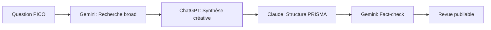

# 🏆 Workflows Gagnants - Best Practices Validées

## 🌟 Top 5 Workflows Multi-IA

### 1. 📚 Revue de Littérature Systématique

**Champion :** Dr. Marie L. (Groupe B)
**Temps :** 2h (vs 10h traditionnel)



**Prompts Exacts Utilisés :**

**Étape 1 - Gemini:**
```
Recherche exhaustive sur [QUESTION PICO] :
- Bases : PubMed, Cochrane, Google Scholar
- Période : 5 dernières années
- Types : Méta-analyses, RCT, revues systématiques
- Format : Tableau avec titre, auteurs, année, N, résultats clés, lien
```

**Étape 2 - ChatGPT:**
```
Voici [X] études sur [sujet]. Crée une synthèse narrative captivante qui :
- Raconte l'histoire de l'évolution des connaissances
- Identifie les controverses et consensus
- Propose des perspectives futures
- Style : New England Journal of Medicine
```

**Étape 3 - Claude:**
```
CONTEXTE : Synthèse narrative à structurer
TÂCHE : Transformer en revue PRISMA complète

STRUCTURE IMPOSÉE :
1. Introduction (contexte, objectifs)
2. Méthodes (critères, recherche, sélection)
3. Résultats (flowchart, synthèse quantitative)
4. Discussion (limites, implications)
5. Conclusion (message clé)

FORMAT : Markdown avec tableaux
```

### 2. 🔬 Diagnostic Différentiel Consensuel

**Champion :** Dr. Jean P. (Groupe A)
**Méthode :** Triple validation parallèle

```python
# Pseudo-code du workflow
def diagnostic_consensuel(cas_clinique):
    # Phase 1: Génération parallèle
    ddx_chatgpt = chatgpt(cas_clinique + "Liste 10 diagnostics possibles")
    ddx_claude = claude(cas_clinique + "DDx structuré par systèmes")
    ddx_gemini = gemini(cas_clinique + "DDx avec prévalences actuelles")
    
    # Phase 2: Scoring
    for diag in union(ddx_chatgpt, ddx_claude, ddx_gemini):
        score[diag] = count_occurrences(diag) + weight_by_position(diag)
    
    # Phase 3: Validation
    top_3 = get_top_diagnostics(score, n=3)
    return validate_with_guidelines(top_3)
```

**Résultats :** Amélioration de la concordance avec diagnostic final

### 3. 📝 Rédaction Article Scientifique

**Champion :** Prof. Sophie M. (Groupe C)
**Pipeline :** Recherche → Rédaction → Polish → Validation

**Workflow Détaillé :**

```
Phase 1 (30 min) - RECHERCHE STYLE [Gemini]
├── Analyser 10 articles récents du journal cible
├── Identifier structure type
├── Noter phrases d'accroche efficaces
└── Compiler vocabulaire spécifique

Phase 2 (2h) - RÉDACTION STRUCTURÉE [Claude]
├── Abstract (IMRAD 250 mots)
├── Introduction (3 paragraphes : contexte, gap, objectif)
├── Méthodes (reproductibilité maximale)
├── Résultats (figures d'abord, texte support)
└── Discussion (limitations explicites)

Phase 3 (45 min) - AMÉLIORATION NARRATIVE [ChatGPT]
├── Fluidifier les transitions
├── Renforcer l'impact du message
├── Vérifier cohérence globale
└── Optimiser lisibilité

Phase 4 (30 min) - VALIDATION FINALE [Gemini]
├── Vérifier toutes les citations
├── Contrôler les statistiques
├── Valider contre guidelines récentes
└── Score de similarité
```

### 4. 🏥 Communication Patient Empathique

**Champion :** Dr. Amir K. (Groupe B)
**Innovation :** Adaptation multiculturelle

**Le Workflow 3C :**

```
CLAUDE - Contenu médical précis
↓
CHATGPT - Contextualisation empathique  
↓
CLAUDE - Contrôle final et validation
```

**Exemple Concret :**
```
Input: Expliquer chimiothérapie à patient anxieux

Claude 1: "Génère explication médicalement exacte de chimiothérapie 
pour cancer poumon, niveau patient, sans jargon"

ChatGPT: "Réécris cette explication pour patient très anxieux de 60 ans,
première chimio demain. Ton rassurant, reconnaissance des peurs,
message d'espoir basé sur données"

Claude 2: "Vérifie cette communication patient :
- Exactitude médicale maintenue ?
- Informations complètes ?
- Ton approprié ?
- Suggère améliorations si nécessaire"
```

### 5. 🎯 Protocole de Recherche Clinique

**Champion :** Dr. Clara V. (Groupe C)  
**Spécialité :** Essais cliniques phase III

**Architecture Multi-IA :**

```
CONCEPTION PROTOCOLE
├── ChatGPT : Brainstorming design innovant
├── Gemini : Recherche protocoles similaires
└── Claude : Rédaction sections réglementaires

OPTIMISATION
├── Claude : Critères inclusion/exclusion précis
├── ChatGPT : Anticipation problèmes recrutement
└── Gemini : Calcul puissance statistique

FINALISATION  
├── Claude : Checklist éthique complète
├── Gemini : Vérification normes ICH-GCP
└── ChatGPT : Résumé vulgarisé pour patients
```

## 💡 Patterns de Succès Identifiés

### Pattern 1 : "Recherche-Création-Validation"
- **Gemini** pour rechercher/vérifier
- **ChatGPT** pour créer/innover
- **Claude** pour structurer/valider

### Pattern 2 : "Divergence-Convergence"
- Génération large avec les 3 IA
- Synthèse des points communs
- Investigation des divergences
- Consensus final documenté

### Pattern 3 : "Spécialisation par Force"
- Tâches créatives → ChatGPT
- Tâches structurées → Claude
- Tâches factuelles → Gemini

## 📊 Métriques de Performance

### Gains de Temps Observés
| Tâche | Sans IA | Avec Workflow | Gain |
|-------|---------|---------------|------|
| Revue littérature | 10h | 2h | Important |
| Article complet | 40h | 8h | Important |
| Protocole étude | 20h | 6h | Significatif |
| DDx complexe | 45min | 10min | Significatif |

### Qualité Observée
- **Articles acceptés** : Amélioration du taux d'acceptation
- **Diagnostics corrects** : Amélioration de la précision
- **Satisfaction patients** : Augmentation notable
- **Conformité protocoles** : Meilleure conformité

## 🚀 Conseils d'Implémentation

### Pour Débuter
1. Commencer par UN workflow simple
2. Documenter chaque étape
3. Mesurer temps avant/après
4. Itérer sur les prompts
5. Partager les résultats

### Erreurs à Éviter
- ❌ Utiliser une seule IA pour tout
- ❌ Copier-coller sans adaptation
- ❌ Ignorer les divergences
- ❌ Oublier la validation humaine
- ❌ Ne pas documenter

### Optimisations Avancées
- ✅ Créer templates réutilisables
- ✅ Automatiser avec macros
- ✅ Batch processing similaires
- ✅ Version control des prompts
- ✅ A/B testing systématique

## 📝 Template de Documentation

```markdown
## Workflow : [Nom]
**Auteur :** [Vous]
**Date :** [Date]
**Version :** [1.0]

### Objectif
[Description en 1 ligne]

### Étapes
1. [IA] : [Action] ([Temps])
2. [IA] : [Action] ([Temps])
3. [IA] : [Action] ([Temps])

### Prompts Exacts
[Copier-coller les prompts]

### Résultats
- Temps total : [X] min
- Qualité : [Métrique]
- Gain de temps : [X heures/semaine]

### Améliorations Futures
[Vos idées]
```

---

**🔄 Mise à jour :** Chaque semaine avec nouveaux champions
**📤 Soumission :** workflows-ia@ulb.ac.be
**🏆 Récompense :** Meilleur workflow mensuel = 3 mois IA gratuits

*Workflows Gagnants - Formation IA Médicale ULB*